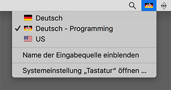
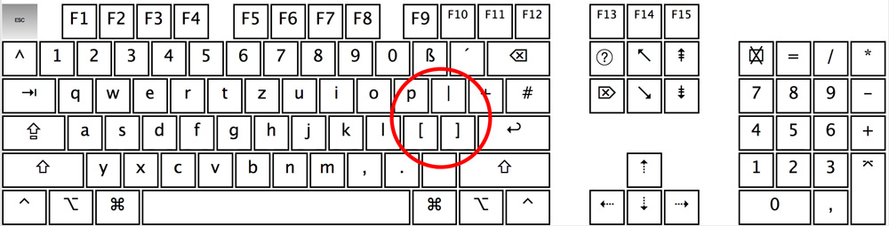
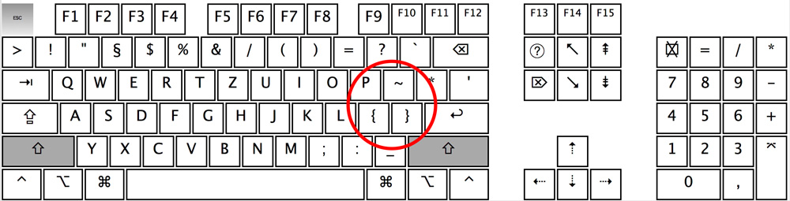
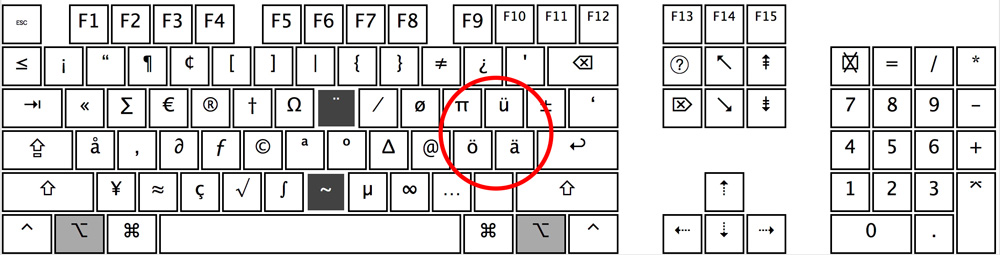
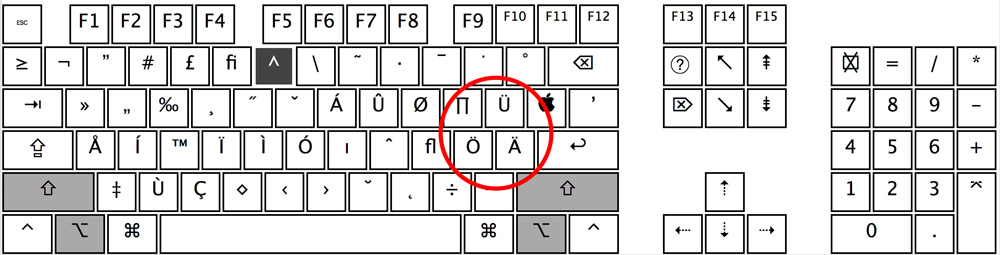

# Deutsches Keyboard Layout zum Programmieren auf macOS

This keyboard layout will make your programming life **much** easier while keeping as many habits of german-keyboard-usage as possible!

- Replaces `äöüÄÖÜ` with `[]{}|~`
- No more dead keys `` ^´` ``
- Access `äöüÄÖÜ` by pressing `option / alt`

**Screenshot:**

**Keyboard layout:**

**Keyboard layout (shift):**

**Keyboard layout (option):**

**Keyboard layout (option + shift):**

### Installation
1. Download and open [Deutsch - Programming.dmg](https://github.com/MickL/macos-keyboard-layout-german-programming/raw/master/keyboard-layout-german-programming.dmg)
2. Drag bundle file
3. Open macOS Systemeinstellungen -> Eingabequellen -> click `+` -> Deutsch -> click `Deutsch - Programmierung` -> click `Hinzufügen`
4. Activate checkbox `Eingabequellen in der Menüleiste anzeigen`
5. Note: You probably want to disable swapping the Eingabequelle when pressing Cmd + Space(which is a common shortcurt on most IDE): Go to `Kurzbefehle` -> `Eingabequellen` -> Disable checkbox `Die vorherige Eingabequelle auswählen`
6. You can now swap the keyboard layout in macOS toolbar

### Other
Made with [Ukelele](https://scripts.sil.org/cms/scripts/page.php?site_id=nrsi&id=ukelele). Feel free to contribute / create pull requests!
